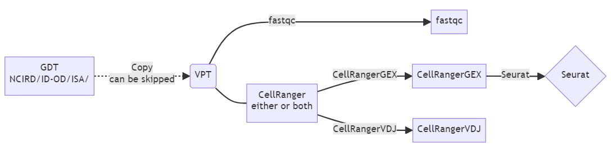
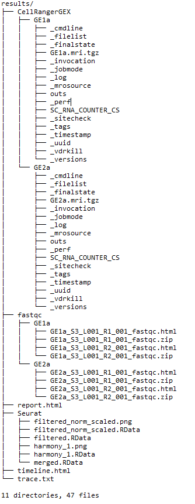

## Introduction

scRNA-seq is a nextflow pipeline for processing 10x Genomics single-cell RNA-seq data using CellRanger and analyzing them using Seurat R package.

## Environment

Currently it is supported on CDC Scicomp SGE system with dependancies in environment.yml.

## Available references

Available references are stored at /scicomp/reference/cellranger/7.1.0. These references include:
* Human reference (GRCh38) dataset
* Mouse reference dataset
* Human reference (GRCh38) and mouse dataset
* GRCh38 Human V(D)J Reference - 7.1.0
* GRCm38 Mouse V(D)J Reference - 7.0.0

VDJ reference for humanized mice is available [here](assets/humanized_vdj_ref). These were built by adding mouse constant genes into the human VDJ reference.

## Workflow



## Usage

1. Determine parameters including: 

* source_directory: the location of the raw sequencing reads at /scicomp/groups-pure/OID/NCIRD/ID-OD/ISA/share/out/VSDB/
* sequencing_directory: the location of VPT space that you want the data to copy into.
	** One sample is in one folder with the name as the sample name.
	** Naming of the reads need to follow: [Sample Name]_S1_L00[Lane Number]_[Read Type]_001.fastq.gz
* skip_copy_step: default is false. If true, copy step won't be run.
* refernce_location: the location that stores the reference for CellRanger.
* analysis_type: GEX or VDJ or GEX_and_VDJ
* expect_cells: expected cell number if running CellRanger GEX analysis.

2. Prepare a samplesheet with the names of samples you want to analysis (deliminated with ','), eg: [samplesheet.csv](samplesheet.csv). The pipeline will run fastqc and CellRanger for all samples in parallell.

3. Activate conda environment.

4. Run the pipeline using:
```
module load nextflow/22.10.6
```
```
nextflow run main.nf \
	--source_directory /path/to/original/sample/reads/
	--sequencing_directory /path/to/desired/sample/reads 
	--reference_location /path/to/reference
	--skip_copy_step <false or true> 
	--expect_cells <a number>
	--analysis_type <GEX or VDJ or GEX_and_VDJ> 
	-c nextflow.config
```
5. Or, instead of running step 3&4, submit this nextflow job to the cluster using qsub. An example submission file is provided [here](assets/qsub.sh).

## Pipeline output




